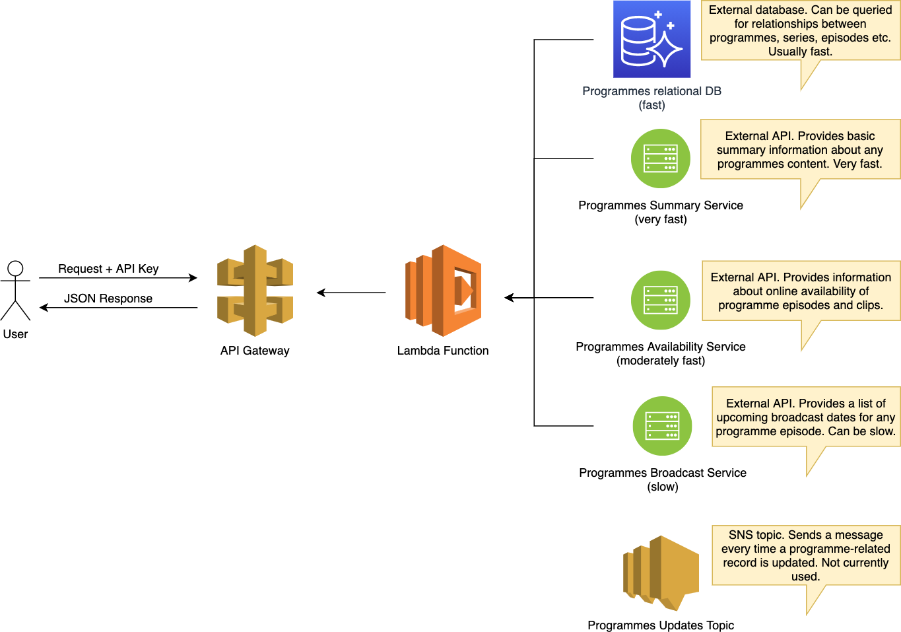

# BBC Programme API technical interview tasks

This is a small API that aggregates data from a number of backend services. Each service has slightly different data models and performance characteristics. The API returns transformed responses suitable for displaying information about programmes on the BBC website.

## Architecture

The API is implemented as a serverless lambda function, integrated via an API gateway. The lambda function handles HTTP request events by fetching and transforming data from appropriate backends.



In this project, you have been provided with the lambda handler code (NodeJS) and API schema (OpenAPI v3).

The API can be run locally with simulated API Gateway events and backend responses.

## Getting up and running
### Installation

In a terminal window, with the API project as the working directory, run `npm install`.

### Running the API locally

In a terminal window, with the API project as the working directory, run `npm start`.

This will create a `localhost` server on port `3000`.

You can access the following endpoints:

> _Notes:_
> - You do not need to provide an API key when running the API locally
> - The data is randomly generated according to the following rules:
>   - Any 8 character id starting with `p` will return a programme
>   - Any 8 character id starting with `s` will return a series
>   - Any 8 character id starting with `e` will return a episode
>   - Any 8 character id starting with `c` will return a clip

**`http://localhost:3000/docs`**

Browse the interactive API documentation and try example requests.

**`http://localhost:3000/programmes/{id}`**

View the summary of a programme, series or episode.

Example: `http://localhost:3000/programmes/e1234567`

**`http://localhost:3000/programmes/episodes`**

View a list of episodes associated with a programme or series.

Example: `http://localhost:3000/programmes/episodes?programme=p1234567&page=2`

**`http://localhost:3000/programmes/episodes/{id}`**

View detailed information about a single episode, including availability and broadcast times.

Example: `http://localhost:3000/programmes/episodes/e1234567`

### Testing the API

The API has some unit tests that can be run with `npm test`.

### File locations

For the following tasks, you will need to edit some project files. These are located at `handler/*.js` and `docs/bbc-programmes-api-spec.json` respectively.

## Tasks
### Task 1

When checking the API logs, the following problem was discovered:

```
Path: /programmes/episodes/etask1
Error: Cannot retrieve summary - no ID provided.
    at getSummary (backends/summary-api.js:17:15)
    at async Promise.all (index 1)
    at async getEpisodeDetail (handler/programme-episode.js:17:53)
    at async exports.handler (handler/index.js:21:20)
```

On closer inspection, it appears that some episodes can belong to a programme but not necessarily a series.

Update the handler function to prevent this issue from happening again.
### Task 2

A customer has provided some new requirements for the API which we have agreed to implement. Before we implement the changes in code, we will suggest an updated API schema for sign-off.

> **Requirement 1:** When the customer displays the details of an episode, they want to show its position within the series. For example, if an episode is the 5th of 12, they would want to display 5/12.

> **Requirement 2:** The customer wants to display the next three broadcast times for an episode, rather than only the next one.

Update the schema to reflect our proposed changes. Be sure to consider any factors other than the customer's requirments that you think may influence how we choose to surface this data. Take note of any assumptions such as where the data will come from.

### Task 3

API users have been reporting a number of timeouts on the `/programmes/episodes/{id}` endpoint. We have traced the problem to a handful of backend requests taking longer than the allocated 4 second time limit we have imposed on the API execution time.

Propose a solution to this problem giving particular consideration to any trade-offs you are aware of.
